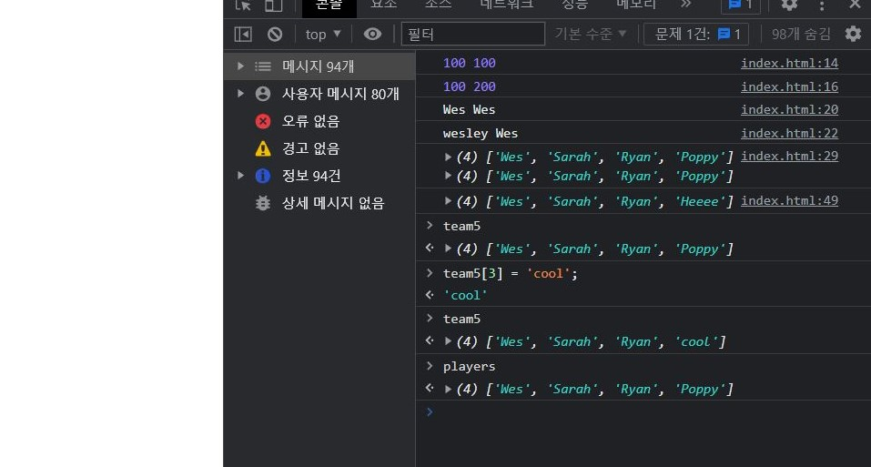

##   JavaScript References VS Copying
 ### 배운 것    
+  Shallow copy
  
### 복습

원시타입인 string, number는 복사 후 복사본의 값을 바꿔도 복사한 원본에 영향이 없음 -> 원시타입은 독립적인 메모리에 값 자체를 할당해서 생성
```
    let age= 100;
    let age2 = age;
    console.log(age,age2); // 100, 100
    age2 =200;
    console.log(age,age2); // 100, 200
 
```
참조타입인 객체나 배열을 복사한 뒤 복사한 배열(객체)의 값을 바꾸면 원본의 값도 같이 바뀐다.   

 ```
    const players = ['Wes', 'Sarah', 'Ryan', 'Poppy'];
    const team =players;
    console.log(players, team);
    team[3] = 'Lux';
    console.log(players, team);
 
     
    ---prints
    ► (4)['Wes', 'Sarah', 'Ryan', 'Poppy'],  ► (4)['Wes', 'Sarah', 'Ryan', 'Poppy']
    ► (4)['Wes', 'Sarah', 'Ryan', 'Lux'],  ► (4)['Wes', 'Sarah', 'Ryan', 'Lux']
     

 ```
 참조타입은 메모리에 독립적으로 값을 할당하는게 아닌 참조값(주소값)이 담긴다. 그러므로 복사하면 참조값이 전달되서 결국 한 데이터를 공유하게된다. 이를 ```얕은 복사(shallow copy)``` 라고 한다.

 ### 참조타입 복사하기
 + .slice   
``` 
const team2 =players.slice();
```

+ .concat   
``` 
const team3 =[].concat(players); 
```
+ spread   
``` 
const team4= [...players];
const dev3 = {...wes};  
```
+ Array.from()      
``` 
const team5= Array.from(players);
```
 
복사가 제대로 된걸 확인 할 수있다!

<br/>

+ Objec.assign 
```
    const wes = {
      name: 'Wes',
      age: 100,
      social: {
        twitter: '@wesbos',
        facebook: 'wesbos.developer'
      }
    }
    const dev = Object.assign({}, wes);

```
```
dev.social.twitter = 'blabla';
console.log(wes.social.twitter); // prints 'blabla'
```
객체를 Object.assign과 전개연산자로 복사를 하게 되면 한수준의 깊이까지는 복사되지만 2차원객체 까지는 완벽히 복사되지않는다.   

제대로 복사하기위해서 JSON으로 치환해서 복사하는 방법이 있음

```
const dev2 = JSON.parse(JSON.stringify(wes));
```
+ JSON.stringify() 메소드는 인수로 객체를 받는다. 받은 객체는 문자열로 치환됨
+ JSON.parse() 메소드는 문자열을 인수로 받는다. 받은 문자열을 객체로 치환됨   
