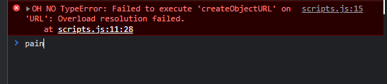

## 19. Webcam Fun

### 복습(알게된 것)     
+ 전체적으로 새로워서 복습하면서 이해를 할 수있었던 파트였다. 픽셀을 다루는건 아직도 어렵게 느껴짐

### video 가져오기 
```
function getVideo(){
  navigator.mediaDevices.getUserMedia({video: true, audio:false})
  .then(localMediaStream => {
    //error 코드
    //video.src = window.URL.createObjectURL(localMediaStream);
    video.srcObject = localMediaStream;
    video.play()
  })
  .catch(err => {
      console.error(`OH NO!!!`, err);
    });
}
```
강의에서 이 코드로 작성하였는데 오류가 뜸


강의의 FINISHED.js스크립트에서 Mdn링크와 함께 해결책을 주석으로 볼 수있었다. MDN을 참고하니 createObjectURL이 브라우저에서 지원이 안된다고 한다. ```video.srcObject = mediaSource;``` 를 이용하여 해결할수 있었다.
 
``` navigator.mediaDevices.getUserMedia```이 메서드로 웹캠을 사용할수 있음. 그리고 video 돔객체를 불러와 src에 캠의 데이터를 연결한다.   
 ```.catch(err => {console.error('...',err)})```  : 에러 발생시 'OH NO!!!'와 에러메세지 콘솔에띄워줌 
 ### canvas에 비디오 연동하기(효과지정)
```
function paintToCanvas() {
  const width = video.videoWidth;
  const height = video.videoHeight;
  canvas.width = width;
  canvas.height = height;

  return setInterval(() => {
    ctx.drawImage(video, 0, 0, width, height);
    // take the pixels out
    let pixels = ctx.getImageData(0, 0, width, height);

    // mess with them
    ctx.globalAlpha = 0.1;
    // pixels = redEffect(pixels);
    // pixels = greenScreen(pixels);
    pixels = rgbSplit(pixels);

    // put them back
    ctx.putImageData(pixels, 0, 0);
  }, 16);
``` 
canvas의 영역을 지정하고, 16ms마다 video의 이미지를 canvas에 연동시켜 실시간 스트리밍효과를 낸다.   
이때 픽셀에 효과(만들어둔 효과 함수)를 지정해준다.
###  캡쳐하기 & 사진 저장하기

```
function takePhoto() {
  // played the sound
  snap.currentTime = 0;
  snap.play();

  // take the data out of the canvas
  const data = canvas.toDataURL('image/jpeg');
  const link = document.createElement('a');
  link.href = data;
  link.setAttribute('download', 'handsome');
  link.innerHTML = ``;
  strip.insertBefore(link, strip.firstChild);
}
```
이 함수가 버튼에 클릭이벤트로 등록되어 실행될때마다 snap을 재생(캡쳐소리가 재생)   
```.toDataURL (canvas method)``` : 캔버스화면 상의 이미지를 지정한 type(default: jpeg)으로 dataURL값을 반환 => img src값으로 할당

```<a> 태그속성- 'download'``` download 속성이 있는 a 태그는 클릭시, 해당 데이터를 다운받을수있음
+   ```.setAttribute('download', 'handsome');``` 뒤에 인자는 다운받을때 파일명이 된다.   

### 효과 (ex- red effect)
```
function redEffect(pixels) {
  for (let i = 0; i < pixels.data.length; i+=4) {
    pixels.data[i + 0] = pixels.data[i + 0] + 200; // RED
    pixels.data[i + 1] = pixels.data[i + 1] - 50; // GREEN
    pixels.data[i + 2] = pixels.data[i + 2] * 0.5; // Blue
  }
  return pixels;
}
```
data에 rgba 값이 차례로 하나씩 찍히기때문에 인덱스 4씩증가함.
pixels의 data에 Red 값을 변경하여 레드스크린으로 만듦
<Br/>
     
 [CanvasRenderingContext2D.drawImage()-mdn](https://developer.mozilla.org/en-US/docs/Web/API/CanvasRenderingContext2D/drawImage)   
// Deprecated - [createObjectURL-mdn](https://developer.mozilla.org/en-US/docs/Web/API/URL/createObjectzzzzURL)   
//  Newer Syntax -  [srcObject-mdn](https://developer.mozilla.org/en-US/docs/Web/API/HTMLMediaElement/srcObject)   
 