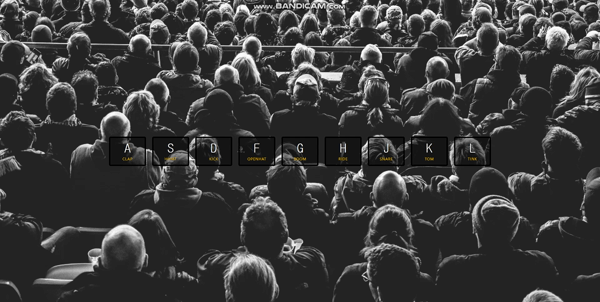

# JavaScript30

### 🚩 JavaScript30 challenge   
짧고 부담없는 프로젝트찾다가 발견한 챌린지. JS감을 더 익히기바라는 마음에 시작!  
> Ref: [wesbos/JavaScript30](https://github.com/wesbos/JavaScript30)    

<br>   

## 01. JavaScript Drum Kit
 

> 특정 키 누를때 오디오 이벤트 
+ 20220425
+ 배운 것: ```transitionend``` 이벤트 , return문에서 값 생략시 undefined 반환

## 02. JS and CSS Clock
 

> 아날로그 시계 만들기    
+ 20220426 
+ 배운 것: transform 세부속성, 시계구현 각도 

## 03. CSS Variables
 

> css값 조절하기    
+ 20220427 
+ 배운 것: ```change``` 이벤트, dataset과 setProperty로 변수다루기

## 04. Array Cardio Day 1
> Array 관련 메서드들
+ 20220428
+ 배운 것 : ```.filter()```   ```.map()```  ```.sort()```  ```.reduce()```   
