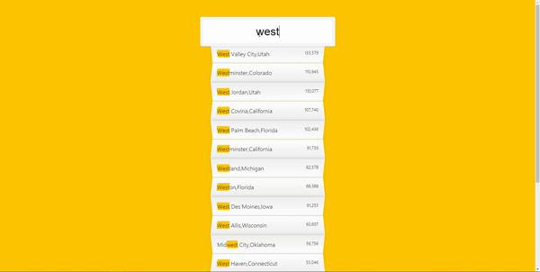
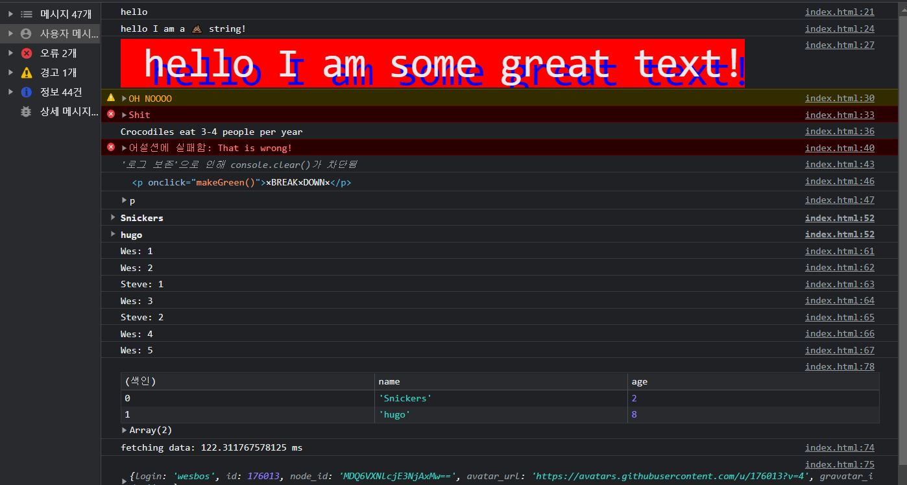
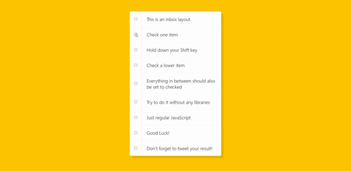
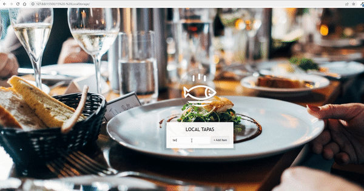
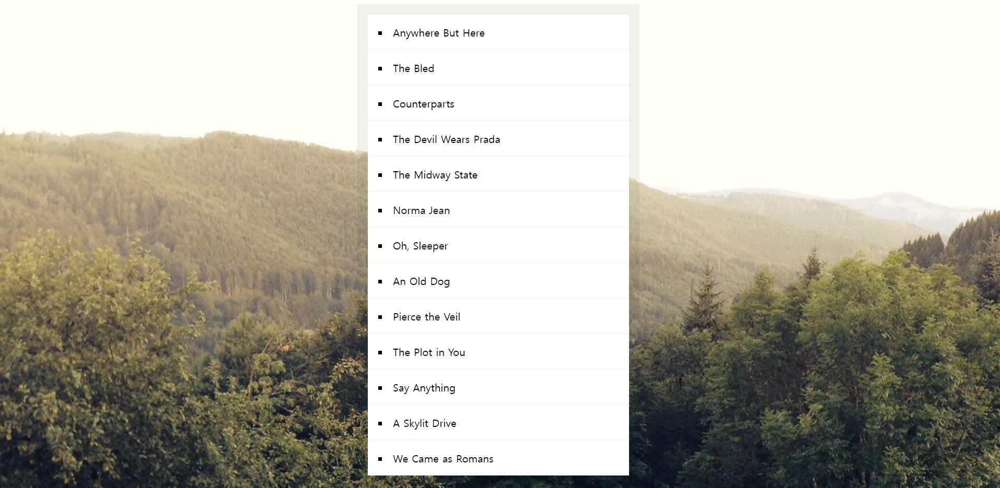
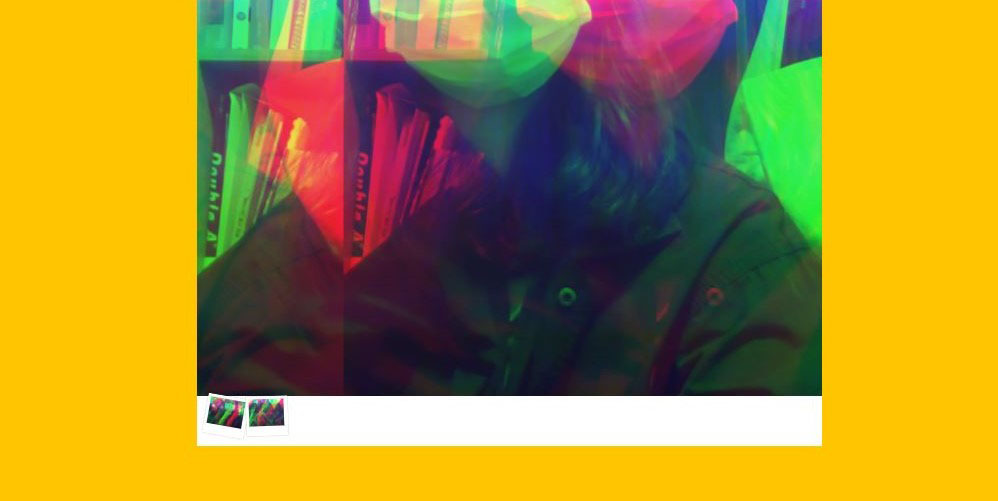

# JavaScript30

### 🚩 JavaScript30 challenge   
짧고 부담없는 프로젝트찾다가 발견한 챌린지. JS감을 더 익히기바라는 마음에 시작!  
> Ref: [wesbos/JavaScript30](https://github.com/wesbos/JavaScript30)    

<br>   
🧐 각 프로젝트마다 README(알게된점 및 복습 기록)파일을 작성하였습니다. 

## 01. JavaScript Drum Kit
 

> 특정 키 누를때 오디오 이벤트 
+ 20220425
+ 배운 것: ```transitionend``` 이벤트 , return문에서 값 생략시 undefined 반환

## 02. JS and CSS Clock
 

> 아날로그 시계 만들기    
+ 20220426 
+ 배운 것: transform 세부속성, 시계구현 각도 

## 03. CSS Variables
 

> css값 조절하기    
+ 20220427 
+ 배운 것 
  + ```change``` 이벤트 
  + dataset, ```:root``` , setProperty로 변수다루기

## 04. Array Cardio Day 1
> Array 관련 메서드들
+ 20220428
+ 배운 것 : ```.filter()```   ```.map()```  ```.sort()```  ```.reduce()```   
<br>

## 05. Flex Panel Gallery
 

> Js로 액티브효과 주기 (with flex)
+ 20220429
+ 배운 것 : ```flex``` 복습 , ```transitionend``` 복습 

## 06. Type Ahead
 

> 검색기능 만들기 
+ 20220501
+ 배운 것 
  + ```fetch```
  + 정규 표현식(Regular Expression), 전개 연산자(Spread Operator)
  + ```.join()```  ```.replace()```  ```.match()``` 

## 07. Array Cardio Day 2
> Array 관련 메서드들 2
+ 20220502
+ 배운 것 
  + ```.some()``` ```.every()``` ```.find()``` ```.findIndex()```
 
## 08. Fun with HTML5 Canvas
 

>  canvas로 그림판 만들기
+ 20220504
+ 배운 것 
  + ```canvas```다루기  
  + 구조 분해 할당
 
## 09. Dev Tools Domination
 

> ```개발자 도구 창``` 다루기  
+ 20220505
+ 배운 것 
  + 콘솔 내에 css 적용 
  + 경고띄우기 ```warn```, ```error``` ,```info``` ,```assert```
  + ```group``` ,```count```, ```time```  등등 
 
## 10. Hold Shift and Check Checkboxes
 

> shift키 + 클릭으로 다중선택하기   
+ 20220509
+ 배운 것 
  + ```shiftKey``` ,변수 활용하기
 
## 11. Custom Video Player
 

> 커스텀 비디오 플레이어 만들기   
+ 20220510
+ 배운 것 
  +  video 속성(태그) 컨트롤 
 
## 12.Key Sequence Detection
 

> 특정 키 조합 누르면 화면에 효과띄우기
+ 20220511
+ 배운 것 
  + ```splice```

## 13. Slide in on Scroll
   

>  스크롤감지하여 이미지 컨트롤
+ 20220514
+ 배운 것 
  +  ```브라우저에서 스크롤 정보를 가져오는 방법```

## 14. JavaScript References VS Copying
 

> 참조와 복사 차이
+ 20220516
+ 배운 것 
  +  ```shallow copy``` - JS 참조와 복사 차이점

## 15. LocalStorage
 

> 로컬스토리지 이용한 ToDoList 
+ 20220517
+ 배운 것  
  +  localStorage

## 16. Mouse Move Shadow
 

> mouse move effect! 
+ 20220518
+ 배운 것  
  + 복습  ```offsetX```, ```offsetWidth```, ```구조분해할당```

## 17. Sort Without Articles
 

>  관사제외하고 알파벳순으로 정렬한 리스트만들기
+ 20220521
+ 배운 것(keyword)
  + 정규표현식
  + sort(), replace(), map()
  + trim()

## 18. Adding Up Times with Reduce

> 여러 개의 타임노드에서 전체시간(시,분,초) 출력하기
+ 20220522
+ 배운 것(keyword)
  + parseFloat(string) 
  + Math.floor
  + selectorAll로 가져오는 것은 ```NodeList``` 배열이랑 다름! 

## 19. Webcam Fun
 

> 웹캠기능과 효과필터 만들기
+ 20220524
+ 배운 것(keyword)   
  +  웹캠 사용하기, 캡쳐해서 이미지저장
  +  픽셀다루기